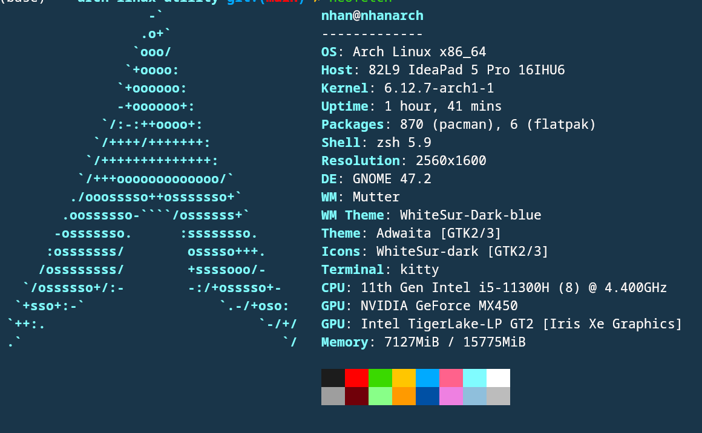

<div align="center">

[](https://github.com/silentz)
[](./LICENSE.txt)


</div>
<h1 align="center">Arch Linux with GNOME. Issue Solved</h1>

<div align="center">
    <i>How to install Arch and using it with less pain </i>
</div>

### Getting Started

This guide is fork of  "Welcome to the Arch Linux with Xfce4 and i3 Window Manager Installation Guide!" But I using GNome and note some Issue when I using arch in my own expirence.

> Note: *TLDR;* To minimize I delete some description of original branch. 

### Support and Feedback

- Issue
- Pull Request

<h1 align="center">
    Section 01: Step-by-step guide of installing Arch Linux on your hardware &#128640;
</h1>

### Step 01: Using Rufus to create Boot USB for Arch Linux
Using window to create boot usb.

1. You must have Window to create Boot usb.
2. Download `.iso` of arch from mirror link.
3. Create boot usb.

### Step 02: Boot into Arch Linux medium

1. Insert the installation medium into the computer on which you are installing Arch Linux.

2. Power on your PC and press _boot menu key_. For _Lenovo_ series laptop,
   this key is `F12`.

3. Boot from USB-stick and wait until boot process is finished.

<dl><dd>
<b>&#128161; IMPORTANT NOTE</b>: not every device can run a system from USB-stick out of the box.
Many BIOS'es by default come with activated <i>Secure boot</i> option.You might need to
deactivate it in your BIOS.
</dd></dl>

### Step 03: Syncronize packages

1. [Optional] Connect to WiFi using `iwctl` and check connection is established:

<dl><dd>
<pre>
$ <b>iwctl</b>
[iwd]# <b>station wlan0 get-networks</b>
[iwd]# <b>station wlan0 connect &lt;Name of WiFi access point&gt;</b>
[iwd]# <b>exit</b>
$ <b>ping 1.1.1.1</b>
</pre>
</dd></dl>

2. Synchronize pacman packaes:

<dl><dd>
<pre>
$ <b>pacman -Syy</b>
</pre>
</dd></dl>

### Step 04: Disk partitioning

1. Partition main storage device using `fdisk` utility. You can find storage device name using `lsblk` command.

<dl><dd>
<pre>
$ <b>fdisk /dev/nvme0n1</b>
                <i>[repeat this command until existing partitions are deleted]</i>
Command (m for help): <b>d</b>
Command (m for help): <b>d</b>
Command (m for help): <b>d</b>
<span />
                <i>[create partition 1: efi]</i>
Command (m for help): <b>n</b>
Partition number (1-128, default 1): <b>Enter &crarr;</b>
First sector (..., default 2048): <b>Enter &crarr;</b>
Last sector ...: <b>+1G</b>
<span />
                <i>[create partition 2: main]</i>
Command (m for help): <b>n</b>
Partition number (2-128, default 2): <b>Enter &crarr;</b>
First sector (..., default ...): <b>Enter &crarr;</b>
Last sector ...: <b>-32G</b> <i>// double size of your RAM</i>
<span />
                <i>[create partition 3: swap]</i>
Command (m for help): <b>n</b>
Partition number (3-128, default 3): <b>Enter &crarr;</b>
First sector (..., default ...): <b>Enter &crarr;</b>
Last sector ...: <b>Enter &crarr;</b>
<span />
                <i>[change partition types]</i>
Command (m for help): <b>t</b>
Partition number (1-3, default 1): <b>1</b>
Partion type or alias (type L to list all): <b>uefi</b>
Command (m for help): <b>t</b>
Partition number (1-3, default 2): <b>2</b>
Partion type or alias (type L to list all): <b>linux</b>
Command (m for help): <b>t</b>
Partition number (1-3, default 3): <b>3</b>
Partion type or alias (type L to list all): <b>swap</b>
<span />
                <i>[write partitioning to disk]</i>
Command (m for help): <b>w</b>
</pre>
</dd></dl>

2. Create filesystems on created disk partitions:

<dl><dd>
<pre>
$ <b>mkfs.fat -F 32 /dev/nvme0n1p1</b> <i># on EFI System partition</i>
$ <b>mkfs -t ext4 /dev/nvme0n1p2</b>   <i># on Linux filesystem partition</i>
$ <b>mkswap /dev/nvme0n1p3</b>         <i># on Linux swap partition</i>
</pre>
</dd></dl>

3. Correctly mount all filesystems to the `/mnt`:

<dl><dd>
<pre>
$ <b>mount /dev/nvme0n1p2 /mnt</b>
$ <b>mkdir -p /mnt/boot/efi</b>
$ <b>mount /dev/nvme0n1p1 /mnt/boot/efi</b>
$ <b>swapon /dev/nvme0n1p3</b>
</pre>
</dd></dl>

4. Install essential packages into new filesystem and generate fstab:

<dl><dd>
<pre>
$ <b>pacstrap -i /mnt base linux linux-firmware sudo vim</b>
$ <b>genfstab -U -p /mnt > /mnt/etc/fstab</b>
</pre>
</dd></dl>

### Step 06: Basic configuration of new system

1. Chroot into freshly created filesystem:

<dl><dd>
<pre>
$ <b>arch-chroot /mnt</b>
</pre>
</dd></dl>

2. Setup system locale and timezone, sync hardware clock with system clock:

<dl><dd>
<pre>
$ <b>vim /etc/locale.gen</b>   <i># uncomment your locales, i.e. `en_US.UTF-8` or `en_GB.UTF-8`</i>
$ <b>locale-gen</b>
$ <b>echo "LANG=en_US.UTF-8" > /etc/locale.conf</b>                <i># choose your locale</i>
$ <b>ln -sf /usr/share/zoneinfo/Asia/Ho_Chi_Minh /etc/localtime</b>   <i># choose your timezone</i>
$ <b>hwclock --systohc</b>
</pre>
</dd></dl>

3. Setup system hostname:

<dl><dd>
<pre>
$ <b>echo <i>yourhostname</i> > /etc/hostname</b>
$ <b>vim /etc/hosts</b>
    <i>127.0.0.1 localhost</i>
    <i>::1       localhost</i>
    <i>127.0.1.1 yourhostname</i>
</pre>
</dd></dl>

4. Add new users and setup passwords:

<dl><dd>
<pre>
$ <b>useradd -m -G wheel,storage,power,audio,video -s /bin/bash yourusername</i></b>
$ <b>passwd root</b>
$ <b>passwd <i>yourusername</i></b>
</pre>
</dd></dl>

5. Add wheel group to sudoers file to allow users to run sudo:

<dl><dd>
<pre>
$ <b>visudo</b>
    <i>[uncomment following line in file]</i>
    <i>%wheel ALL=(ALL) ALL</i>
</pre>
</dd></dl>

6. Install and configure GRUB:

<dl><dd>
<pre>
$ <b>pacman -S grub efibootmgr</b>
$ <b>grub-install /dev/nvme0n1</b>
$ <b>grub-mkconfig -o /boot/grub/grub.cfg</b>
</pre>
</dd></dl>

7. Setup networking stack:

<dl><dd>
<pre>
$ <b>pacman -S dhcpcd networkmanager resolvconf</b>
$ <b>systemctl enable dhcpcd</b>
$ <b>systemctl enable NetworkManager</b>
$ <b>systemctl enable systemd-resolved</b>
</pre>
</dd></dl>

8. Exit chroot, unmount all disks and reboot:

<dl><dd>
<pre>
$ <b>exit</b>
$ <b>umount /mnt/boot/efi</b>
$ <b>umount /mnt</b>
$ <b>reboot</b>
</pre>
</dd></dl>

<h1 align="center">
    Section 02: Configuring userspace after initial system setup &#127919;
</h1>

### Step 01: Basic configuration of userspace

1. Activate time syncronization using NTP:

<dl><dd>
<pre>
$ <b>timedatectl set-ntp true</b>
</pre>
</dd></dl>

2. [Optional] Connect to WiFi using `nmcli`:

<dl><dd>
<pre>
$ <b>nmcli device wifi connect &lt;Name of WiFi access point&gt; password &lt;password&gt;</b>
</pre>
</dd></dl>

3. Install X.Org and its utilities:

<dl><dd>
<pre>
$ <b>sudo pacman -S xorg xorg-apps xorg-xinit xorg-xlsfonts xdotool xclip xsel</b>
</pre>
</dd></dl>

4. Install a bunch of useful utilities:

Not required all but some dependencies is needed for setup ( has `*` in comment)
<dl><dd>
<pre>
$ <b>sudo pacman -S dbus</b>              <i># *Message bus used by many applications</i>
$ <b>sudo pacman -S intel-ucode</b>       <i># *Microcode update files for Intel CPUs</i>
$ <b>sudo pacman -S fuse2</b>             <i># Interface for programs to export a filesystem to the Linux kernel</i>
$ <b>sudo pacman -S lshw</b>              <i># Provides detailed information on the hardware of the machine</i>
$ <b>sudo pacman -S powertop</b>          <i># A tool to diagnose issues with power consumption and power management</i>
$ <b>sudo pacman -S inxi</b>              <i># Full featured CLI system information tool</i>
$ <b>sudo pacman -S acpi</b>              <i># Client for battery, power, and thermal readings</i>
<div><div/>
$ <b>sudo pacman -S base-devel</b>        <i># *Basic tools to build Arch Linux packages</i>
$ <b>sudo pacman -S git</b>               <i># *Distributed version control system</i>
$ <b>sudo pacman -S zip</b>               <i># *Compressor/archiver for creating and modifying zipfiles</i>
$ <b>sudo pacman -S unzip</b>             <i># *For extracting and viewing files in .zip archives</i>
$ <b>sudo pacman -S p7zip</b>             <i># For extracting and viewing files in .7z archives</i>
$ <b>sudo pacman -S htop</b>              <i># *Interactive CLI process viewer</i>
$ <b>sudo pacman -S tree</b>              <i># A directory listing program</i>
<div><div/>
$ <b>sudo pacman -S dialog</b>            <i># A tool to display dialog boxes from shell scripts</i>
$ <b>sudo pacman -S reflector</b>         <i># Script to retrieve and filter the latest Pacman mirror list</i>
$ <b>sudo pacman -S bash-completion</b>   <i># Programmable completion for the bash shell</i>
<div><div/>
$ <b>sudo pacman -S iw</b>                <i># CLI configuration utility for wireless devices</i>
$ <b>sudo pacman -S wpa_supplicant</b>    <i># A utility providing key negotiation for WPA wireless networks</i>
$ <b>sudo pacman -S tcpdump</b>           <i># Powerful command-line packet analyzer</i>
$ <b>sudo pacman -S mtr</b>               <i># Combines the functionality of traceroute and ping into one tool</i>
$ <b>sudo pacman -S net-tools</b>         <i># *Configuration tools for Linux networking</i>
$ <b>sudo pacman -S conntrack-tools</b>   <i># Userspace tools to interact with the Netfilter tracking system</i>
$ <b>sudo pacman -S ethtool</b>           <i># Utility for controlling network drivers and hardware</i>
$ <b>sudo pacman -S wget</b>              <i># *Network utility to retrieve files from the Web</i>
$ <b>sudo pacman -S rsync</b>             <i># File copying tool for remote and local files</i>
$ <b>sudo pacman -S socat</b>             <i># Multipurpose socket relay</i>
$ <b>sudo pacman -S openbsd-netcat</b>    <i># Netcat program. OpenBSD variant.</i>
$ <b>sudo pacman -S axel</b>              <i># Light command line download accelerator</i>
$ <b>sudo pacman -S bind</b>              <i># I use dig utility for DNS resolution from this package</i>
</pre>
</dd></dl>

<h1 align="center">
    Section 03: Install Gnome
</h1>

1. Install `GNome`
You need `xorg` installed also.
`Xorg`, part of *X Windows System* is display server that manages graphical output for applications on Arch Linux.

<dl><dd>
<pre>
sudo pacman -S xorg xorg-server
</pre>
</dl></dd>

3. Install GNOME
<dl><dd>
<pre>
sudo pacman -S gnome
</pre>
</dl></dd>

4. Install Display manager
To handle user logins, manage sessions, initilize  the graphical environment on system startup. `GDM` is default of GNOME. 

<dl><dd>
<pre>
sudo pacman -S gdm
</pre>
</dl></dd>

5. Enable GDM
<dl><dd>
<pre>
sudo systemctl enable --now gdm.service
</pre>
 Check status of GDM. It must be running.

 <pre>sudo systemctl status gdm.service </pre>
</dl>
</dd>

6. Reboot
 <dl><dd>
 <pre>
reboot</pre>
 </dl></dd>

7. Install essential system fonts:

<dl><dd>
<pre>
$ <b>sudo pacman -S ttf-dejavu ttf-freefont ttf-liberation ttf-droid terminus-font</b>
$ <b>sudo pacman -S noto-fonts noto-fonts-emoji ttf-ubuntu-font-family ttf-roboto ttf-roboto-mono</b>
</pre>
</dd></dl>

8. [Optional] Enable sound support on your PC:

<dl><dd>
<pre>
$ <b>sudo pacman -S sof-firmware</b>    # Sound Open Firmware
$ <b>sudo pacman -S pulseaudio</b>      # A featureful, general-purpose sound server
$ <b>sudo pacman -S pavucontrol</b>     # PulseAudio Volume Control
$ <b>sudo pacman -S alsa-utils</b>      # Advanced Linux Sound Architecture - Utilities
$ <b>sudo pacman -S alsa-plugins</b>    # Additional ALSA plugins
</pre>
</dd></dl>

9. [Optional] Enable bluetooth support on your PC:

<dl><dd>
<pre>
$ <b>sudo pacman -S bluez bluez-utils blueman</b>
$ <b>sudo systemctl enable bluetooth</b>
</pre>
</dd></dl>

10. [Optional] Install NetworkManager addons:

<dl><dd>
<pre>
$ <b>sudo pacman -S nm-connection-editor networkmanager-openvpn</b>
</pre>
</dd></dl>

11. [Optional] Install vulkan drivers:

<dl><dd>
<pre>
$ <b>pacman -S mesa vulkan-intel</b>   <i># only for systems with Intel graphics</i>
$ <b>pacman -S nvidia-utils</b>        <i># only for systems with Nvidia graphics</i>
$ <b>pacman -S amdvlk</b>              <i># only for systems with AMD graphics</i>
</pre>
</dd></dl>

<h1 align="center">
    Section 03: Installing third-party apps and <br>
    setting up dev environment &#129489;&#8205;&#128187;
</h1>
<div align="center">
    <i>These is my personal list of apps and utilities which I use on regular basis,
    so feel free to fork this repo and add something yours. (I am Java backend developer ☕)</i>
</div>

### Step 01: General-purpose apps

<dl><dd>
<pre>
$ <b>sudo pacman -S firefox</b>           <i># web-browser</i>
$ <b>sudo pacman -S obsidian</b>          <i># note-taking app</i>
$ <b>sudo pacman -S file-roller</b>       <i># archive manager</i>
$ <b>sudo pacman -S evince</b>            <i># pdf viewer</i>
$ <b>sudo pacman -S xournalpp</b>         <i># pdf editor</i>
$ <b>sudo pacman -S libreoffice</b>       <i># office packages</i>
$ <b>sudo pacman -S gimp</b>              <i># image editor</i>
$ <b>sudo pacman -S gpick</b>             <i># color picker</i>
$ <b>sudo pacman -S inkscape</b>          <i># vector graphics editor</i>
$ <b>sudo pacman -S fontforge</b>         <i># fonts editor</i>
$ <b>sudo pacman -S gparted</b>           <i># grphical disk management tool</i>
$ <b>sudo pacman -S vlc</b>               <i># video player</i>
$ <b>sudo pacman -S remmina</b>           <i># remote desktop client</i>
$ <b>sudo pacman -S shotcut</b>           <i># video editing tool</i>
$ <b>sudo pacman -S evolution</b>         <i># email client</i>
$ <b>sudo pacman -S redshift</b>          <i># adjusts the color temperature of your screen</i>
$ <b>sudo pacman -S obs-studio</b>        <i># screencasting and streaming app</i>
$ <b>sudo pacman -S wireshark-qt</b>      <i># network protocol analyzer</i>
$ <b>sudo pacman -S spotify-launcher</b>  <i># spotify client</i>
$ <b>sudo pacman -S telegram-desktop</b>  <i># my preffered messenger</i>
$ <b>sudo pacman -S rclone</b>            <i># manage or migrate files on cloud storage</i>
$ <b>sudo pacman -S openvpn</b>           <i># openvpn client</i>
$ <b>sudo pacman -S wireguard-tools</b>   <i># wireguard client</i>
$ <b>sudo pacman -S arandr</b>            <i># gui for xrandr</i>
</pre>
</dd></dl>

### Step 02: Install package manager for AUR (Arch User Repository)

<dl><dd>
<pre>
$ <b>git clone https://aur.archlinux.org/yay.git</b>
$ <b>cd yay</b>
$ <b>makepkg -si</b>
</pre>
</dd></dl>

### Step 03: Software development tools

1. General purpose development tools:

<dl><dd>
<pre>
$ <b>sudo pacman -S neovim</b>          <i># powerful console editor</i>
$ <b>sudo pacman -S zed</b>             <i># ultimate graphical editor</i>
$ <b>sudo pacman -S tree-sitter</b>     <i># parsing system for programming tools</i>
$ <b>sudo pacman -S tree-sitter-cli</b> <i># cli tool tree-sitter parsers</i>
$ <b>sudo pacman -S stow</b>            <i># configuration manager</i>
$ <b>sudo pacman -S sqlite3</b>         <i># console sqlite client</i>
$ <b>sudo pacman -S tldr</b>            <i># collection of simplified man pages</i>
$ <b>sudo pacman -S jq</b>              <i># cli json processor</i>
$ <b>sudo pacman -S tmux</b>            <i># terminal session multiplexer</i>
$ <b>sudo pacman -S nmap</b>            <i># network scanner with advanced features</i>
$ <b>sudo pacman -S masscan</b>         <i># high performance network scanner</i>
$ <b>sudo pacman -S pgcli</b>           <i># console client for PostgreSQL</i>
$ <b>sudo pacman -S redis</b>           <i># console client for Redis</i>
$ <b>sudo pacman -S apache</b>          <i># http server + some useful utilities (htpasswd)</i>
$ <b>sudo pacman -S meld</b>            <i># git visual diff and merge tool</i>
$ <b>sudo pacman -S websocat</b>        <i># command line client for websockets</i>
$ <b>sudo pacman -S sshpass</b>         <i># noninteractive ssh password provider</i>
$ <b>sudo pacman -S git-filter-repo</b> <i># faster and safer git-filter-branch alternative</i>
</pre>
</dd></dl>

<dl><dd>
<b>&#128161; IMPORTANT NOTE</b>: execute <code>sudo setcap 'cap_net_raw+epi' /usr/bin/masscan</code> to enable
the ability to run <code>masscan</code> as non-root user.
</dd></dl>

2. Infrastructure as a Code and DevOps tools:

<dl><dd>
<pre>
$ <b>sudo pacman -S ansible</b>          <i># infrastructure as a code tool (bare metal)</i>
$ <b>sudo pacman -S podman</b>           <i># cli tool for container management</i>
$ <b>sudo pacman -S podman-compose</b>   <i># run multi-container applications with podman</i>
$ <b>sudo pacman -S docker</b>           <i># cli tool for container management</i>
$ <b>sudo pacman -S docker-compose</b>   <i># run multi-container applications with docker</i>
$ <b>sudo pacman -S kubectl</b>          <i># cli tool for managing kubernetes clusters</i>
$ <b>sudo pacman -S helm</b>             <i># package manager for kubernetes</i>
$ <b>sudo pacman -S terraform</b>        <i># infrastructure as a code tool (clouds)</i>
<div></div>
<i># configure docker</i>
<div></div>
$ <b>sudo systemctl enable docker</b>            <i># enable docker daemon on system start</i>
# <b>sudo usermod -a -G docker yourusername</b>  <i># to be able to run docker as non-root</i>
$ <b>newgrp docker</b>                           <i># login to docker group without restart</i>
</pre>
</dd></dl>

3. Install Golang and its tools:

<dl><dd>
<pre>
$ <b>sudo pacman -S go</b>
$ <b>go install github.com/fullstorydev/grpcurl/cmd/grpcurl@latest</b>
$ <b>go install github.com/hairyhenderson/gomplate/v4/cmd/gomplate@latest</b>
</pre>
</dd></dl>

4. Install Java and its tools:


<dl>
<dd>
Using `SDKMAN` to do this
    <pre>curl -s "https://get.sdkman.io" | bash</pre>
    </dd>
    <dd>
    Then install jsk (for example Graalvm):
    <pre>sdk install java 23.0.1-graal</pre>

</dd>
</dl>


5. Install Dart and Flutter following instructions from https://docs.flutter.dev/get-started/install/linux

6. Install C, C++ and tools for low-level development:

<dl><dd>
<pre>
$ <b>sudo pacman -S gcc</b>         <i># GNU Compiler Collection, C and C++ frontends</i>
$ <b>sudo pacman -S gdb</b>         <i># GNU Debugger</i>
$ <b>sudo pacman -S clang</b>       <i># C/C++ frontend compiler for LLVM</i>
$ <b>sudo pacman -S cmake</b>       <i># C/C++ project management tool</i>
$ <b>sudo pacman -S ninja</b>       <i># Build system with a focus on speed</i>
$ <b>sudo pacman -S cuda</b>        <i># NVIDIA GPU programming toolkit</i>
$ <b>sudo pacman -S nasm</b>        <i># Asssembler for the x86 CPU architecture</i>
$ <b>sudo pacman -S boost</b>       <i># C++ library with general purpose utils and data structures</i>
$ <b>sudo pacman -S cdrtools</b>    <i># CD/DVD/BluRay command line recording software</i>
$ <b>sudo pacman -S qemu-full</b>   <i># Open source machine emulator and virtualizer</i>
</pre>
</dd></dl>

7. Install Miniconda, Python:

<dl><dd>
Conda is good choice for ml and data science.
<pre>
$ <b> yay -S miniconda3
</pre>
</dd></dl>

8. Install Lua:

<dl><dd>
<pre>
$ <b>sudo pacman -S lua</b>       <i># Collection of Lua tools</i>
</pre>
</dd></dl>

9. Install JavaScript and its tools:

<dl><dd>
<pre>
$ <b>sudo pacman -S nodejs</b>
$ <b>sudo pacman -S npm</b>
$ <b>sudo npm install -g npm typescript yarn @nestjs/cli</b><i>
</pre>
</dd></dl>

10. Install Rust and its tools:

<dl><dd>
<pre>
$ <b>sudo pacman -S rust</b>     <i># Rust compiler and tools for project management</i>
</pre>
</dd></dl>

11. Install Virtualbox:

<dl><dd>
<pre>
$ <b>sudo pacman -S linux-headers</b>          <i># Headers for building Linux kernel modules</i>
$ <b>sudo pacman -S virtualbox-host-dkms</b>   <i># VirtualBox Host kernel modules sources</i>
$ <b>sudo pacman -S virtualbox</b>             <i># Hypervisor for x86 virtualization</i>
</pre>
</dd></dl>

12. Architecture diagraming tools:

<dl><dd>
<pre>
$ <b>sudo pacman -S plantuml</b>    <i># Tool for creating UML diagrams</i>
</pre>
</dd></dl>

13. Install hugo (static website generator):

<dl><dd>
<pre>
$ <b>sudo pacman -S hugo</b>        <i># fast and flexible static site generator in go</i>
$ <b>sudo pacman -S dart-sass</b>   <i># implementation of sass (required for hugo)</i>
</pre>
</dd></dl>

14. Accounting software:

<dl><dd>
<pre>
$ <b>sudo pacman -S gnucash</b>   <i># Personal and small-business financial-accounting application</i>
</pre>
</dd></dl>

15. 3D-Printing software:

<dl><dd>
<pre>
$ <b>sudo pacman -S freecad</b>       <i># Feature based parametric 3D CAD modeler</i>
$ <b>sudo pacman -S prusa-slicer</b>  <i># G-code generator for 3D printers</i>
</pre>
</dd></dl>

### Step 04: Install Wine (Windows application runner)

1. Go to `/etc/pacman.conf` and uncomment (or add) following lines:

<dl><dd>
<pre>
<i>[multilib]</i>
<i>Include = /etc/pacman.d/mirrorlist</i>
</pre>
</dd></dl>

2. Update package database:

<dl><dd>
<pre>
$ <b>sudo pacman -Syu</b>
</pre>
</dd></dl>

3. Install Wine and its utilities:

<dl><dd>
<pre>
$ <b>sudo pacman -S wine</b>         <i># Compatibility layer for running Windows programs</i>
$ <b>sudo pacman -S wine-mono</b>    <i># Wine's replacement for Microsoft's .NET Framework</i>
$ <b>sudo pacman -S wine-gecko</b>   <i># Wine's replacement for Microsoft's Internet Explorer</i>
$ <b>sudo pacman -S winetricks</b>   <i># Installer for various runtime libraries in Wine</i>
$ <b>sudo pacman -S zenity</b>       <i># Display dialog boxes from shell scripts (wine dependency)</i>
</pre>
</dd></dl>

4. Configure smooth font in Wine applications:

<dl><dd>
<pre>
$ <b>winetricks settings fontsmooth=rgb</b>
</pre>
</dd></dl>

<dl><dd>
<b>&#128161; IMPORTANT NOTE</b>: if you are facing error
<code>wine: Read access denied for device L"\\??\\Z:\\", FS volume label and serial are not available</code>,
go to <code>~/.wine/dosdevices</code>, remove <code>z:</code> symbolic link and make it point to your <code>$HOME</code>
</dd></dl>

### Step 05: Install texlive (LaTeX distribution)

<dl><dd>

## minium install
I feed missing some pack if need vietnamese latex you should install texlive-full

```bashbash
texlive-bin # TeX Live binaries
texlive-core # TeX Live core distribution
```

## math
```bash
texlive-science # TeX Live - Typesetting for mathematics, natural and computer sciences
texlive-pictures # TeX Live - Packages for drawings graphics
texlive-pstricks # TeX Live - Additional PSTricks packages
```

## for authblk.sty
```bash
texlive-latexextra # TeX Live - Large collection of add-on packages for LaTeX
```

## install latex editor
I prefer `texstudio`
```bash
yay -S texstudio
```
</dd></dl>

### Step 06: Setup Android development tools

<dl><dd>

I recommend using jetbrains-toolbox to manage jetbrains ide. Download jetbrains-toolbox from aur.

```bash
yay -S jetbrains-toolbox
```
</dd></dl>

1. Download Android Studio using `jetbrains-toolbox`

2. Copy cmdline-tools to `$ANDROID_HOME` (in my case `~/Android`):
of set up using ui of Android studio.

<dl><dd>
<pre>
$ <b>unzip commandlinetools-linux-..._latest.zip</b>    <i># archive you got from website</i>
$ <b>mkdir -p ~/Android/cmdline-tools/latest</b>
$ <b>mv ./cmdline-tools/* ~/Android/cmdline-tools/latest/</b>
</pre>
</dd></dl>

3. Set `ANDROID_HOME` environment variable to `~/Andoird` in `.bashrc`

4. Install platform tools, build tools and accept all licenses:

<dl><dd>
<pre>
$ <b>sdkmanager "platform-tools" "platforms;android-29"</b>
$ <b>sdkmanager "build-tools;29.0.3"</b>
$ <b>sdkmanager --licenses</b>
$ <b>sdkmanager --update</b>
</pre>
</dd></dl>

### Step 07: Install Yubikey tools

<dl><dd>
<pre>
$ <b>sudo pacman -S yubikey-manager</b>
$ <b>sudo pacman -S yubikey-personalization-gui</b>
</pre>
</dd></dl>

### Step 8: Install Vietnamese Keyboard Support
<dl>
<dd>
<pre>yay -s ibus-bamboo</pre>
</dd>
</dl>


<h1 align="center">
    Section 04: Other useful config and Fix issue<br>
</h1>

## Configuration
- [Set up SSH key for git, GitHub](./install_guide/git.md)

## Fix Issue


## Screen
Ejoy 



<div style="text-align: center">Enjoy Your life</div>